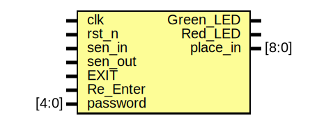

# Entity: Parking_Sys 
- **File**: park.sv

## Diagram

## Ports

| Port name | Direction | Type  | Description |
| --------- | --------- | ----- | ----------- |
| clk       | input     |       |             |
| rst_n     | input     |       |             |
| sen_in    | input     |       |             |
| sen_out   | input     |       |             |
| EXIT      | input     |       |             |
| Re_Enter  | input     |       |             |
| password  | input     | [4:0] |             |
| Green_LED | output    |       |             |
| Red_LED   | output    |       |             |
| place_in  | output    | [8:0] |             |

## Signals

| Name      | Type        | Description |
| --------- | ----------- | ----------- |
| full      | wire        |             |
| empty     | wire        |             |
| enable    | reg         |             |
| BUF       | reg         |             |
| place_out | wire [15:0] |             |
| Right     | reg         |             |
| Wrong     | reg         |             |
| cs        | reg [2:0]   |             |
| ns        | reg [2:0]   |             |

## Constants

| Name          | Type | Value  | Description |
| ------------- | ---- | ------ | ----------- |
| IDLE          |      | 3'b000 |             |
| WAIT_PASSWORD |      | 3'b001 |             |
| CHK_PASS      |      | 3'b010 |             |
| RIGHT_PASS    |      | 3'b011 |             |
| WRONG_PASS    |      | 3'b100 |             |
| PLACING       |      | 3'b101 |             |

## Processes
- unnamed: ( @(posedge clk) )
  - **Type:** always
- unnamed: ( @(posedge clk) )
  - **Type:** always
- unnamed: ( @(posedge clk) )
  - **Type:** always
